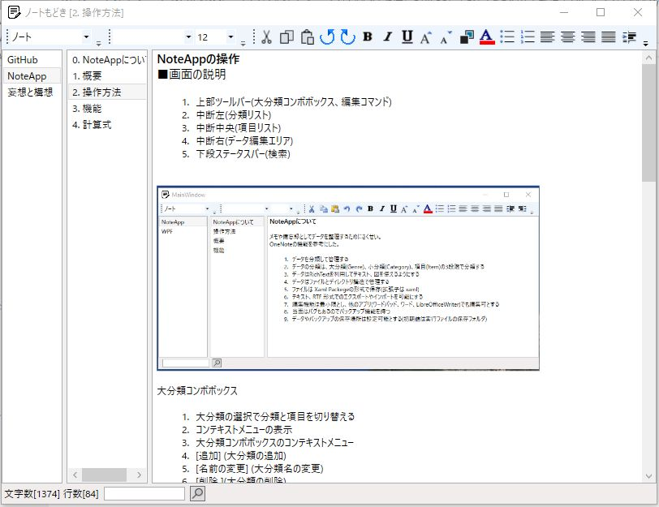

# ノートもどき [NoteApp]
## メモや備忘録のように手軽にドキュメントを整理するツール
### WPFのRichTextBoxの機能を使って作成

 

実行方法は[NoteApp.zip](NoteApp.zip)をダウンロードし適当なフォルダーに展開してNoteApp.exeを実行する。  

起動後にサンプルデータが表示されない時は画面左上の大分類のコンボボックスでマウスの右ボタンを押しコンテキストメニューを出し「初期値に戻す」を選択する。
  
#### ■おもな機能

ドキュメントの管理
1.	データを分類して管理する
2.	データの分類は、大分類(Genre)、小分類(Category)、項目(Item)の3段階で分類する
3.	データはRichTextを利用してテキスト、図を使えるようにする
4.	データはファイルとディレクトリ構造で管理する
5.	ファイルは Xaml Packegeの形式で保存(拡張子は xaml)
6.	テキスト、RTF 形式でのエクスポートやインポートを可能にする
7.	編集機能は最小限とし、他のアプリ(ワードパッド、ワード、LibreOfficeWriter)でも編集可とする
8.	当面はバグもあるのでバックアップ機能を持つ
9.	データやバックアップの保存場所は設定可能とする(初期値は実行ファイルの保存フォルダ)
10.  項目を別の分類にリンク表示できる

エディタの機能
1.	文字フォント、文字サイズの変更ができる
2.	文字の色、文字の背景色の設定ができる
3.	図の挿入は段落単位でできるが、現状大きさの変更ができない。大きさを変更したい場合には、項目リストのコンテキストメニューで他のアプリで開いて編集する
4.	ドキュメント内に数式がある場合には数式を選択してコンテキストメニューの計算で計算処理ができる
5.	ドキュメント内にURLやフルパスのファイル名がある場合にカーソルをあててマウスのダブルクリックを行うと開くことができる
6.	今日の日時の挿入や西暦と和暦の変換
7.	スクリーンキャプチャ機能で画面の一部切り取って挿入
8.	Webアドレスのエスケープシーケンスを日本語に変換

 
### ■ちょっとした特徴  

・数式を選択して計算することができる。  
    1)  数式以外の文字は除外して計算できるので以下の集計ができる  
    　　りんご    +100円 * 2個  
    　　ミカン     +80円 * 3個  
    　　バナナ     +50円 * 5個 = 690  
    　　実際の計算は  100*2+80*3+50*5 = 690  となる  
    
    2)  [] で囲まれたところを引数として引数として計算できる  
    　　[体重kg] = 65 kg  
    　　[身長m] = 1.7 m  
    　　BMI   [体重kg]/([身長m]*[身長m])  

・日時の挿入と変換(コンテキストメニューからの選択)  
　　例: 日付の挿入 2023年4月13日  時刻の挿入 午後9時58分51秒   
　　例: 西暦から和暦に 2023年4月15日 → 令和5年4月15日  
　　　　和暦から西暦に 令和5年4月15日 → 2023年4月15日  
　　　　曜日の挿入は  2023年4月15日 土曜日  

### ■履歴  
2023/04/07 初回登録  
2023/04/14 日時の 挿入・変換機能追加  
2023/04/21 スクリーンキャプチャ機能を追加  
2023/04/23 クリップボードの画像データを大きさを指定して貼り付け  
2023/05/04 項目のリンク機能の追加、項目の属性表示追加  
2023/05/07 Webアドレス変換(URLのエスケープシーケンスを解除)を追加  
2024/03/04 スクリーンキャプチャで3秒のタイムラグを追加(操作後にマウス操作ができるようにした)  
2024/03/22 バックアップ処理をシステム設定ダイヤログにまとめる、スクリーンキャプチャのタイムラグも設定可とした  
2024/09/14 コンテキストメニューに「開く」を追加(spを含んだパスを実行するため)  
2025/05/04 計算にF9キー、日時挿入にF8キー、Webアドレス変換にF7キーを割り当てる  

### ■実行環境
Windows10で動作の確認
ソフトの実行方法は NoteApp.zip をダウンロードして適当なフォルダに展開し、フォルダ内の NoteApp.exe をダブルクリックして実行する。  
起動後にサンプルデータが表示されない時は画面左上の大分類のコンボボックスでマウスの右ボタンを押してコンテキストメニューを出し「初期値に戻す」を選択する。

### ■開発環境  
開発ソフト : Microsoft Visual Studio 2022  
開発言語　 : C# 7.3 Windows アプリケーション  
フレームワーク : .NET framework 4.8  
自作ライブラリ  : WpfLib